# Backoffice System Flows

เอกสารนี้สรุปการทำงานของระบบหลังบ้านแบบแยกตามหน้า พร้อม sequence diagram สำหรับใช้เป็น reference ของทีม

## โครงสร้างระบบ

องค์ประกอบหลักของระบบ:

- `Nuxt Backoffice UI`
- `Firestore`
- `Firebase Storage`
- `stats_ledger`
- `dashboard_stats`
- `dashboard_brand_stats`

กติกาหลัก:

- แบรนด์อยู่ใน global collection `brands/{brandId}`
- ความสัมพันธ์ Category -> Brand ใช้ `category_brands` เท่านั้น
- สถานะสินค้าที่ persist จริงมีแค่ `ACTIVE | RESERVED | SOLD`
- `DELETED` เป็น derived state จาก `is_deleted=true`
- `show=true` คือเปิดแสดงบนหน้าเว็บ
- `confirmSale` และ `undoSale` ต้องทำผ่าน transaction
- `stats_ledger` ใช้สำหรับ idempotency
- dashboard docs เป็น cached aggregates และต้องอัปเดตตอน write

## 1. Login Page

หน้าที่:

- ให้ผู้ใช้เข้าสู่ระบบด้วย Google
- ตรวจสิทธิ์เข้าใช้งานหลังบ้าน

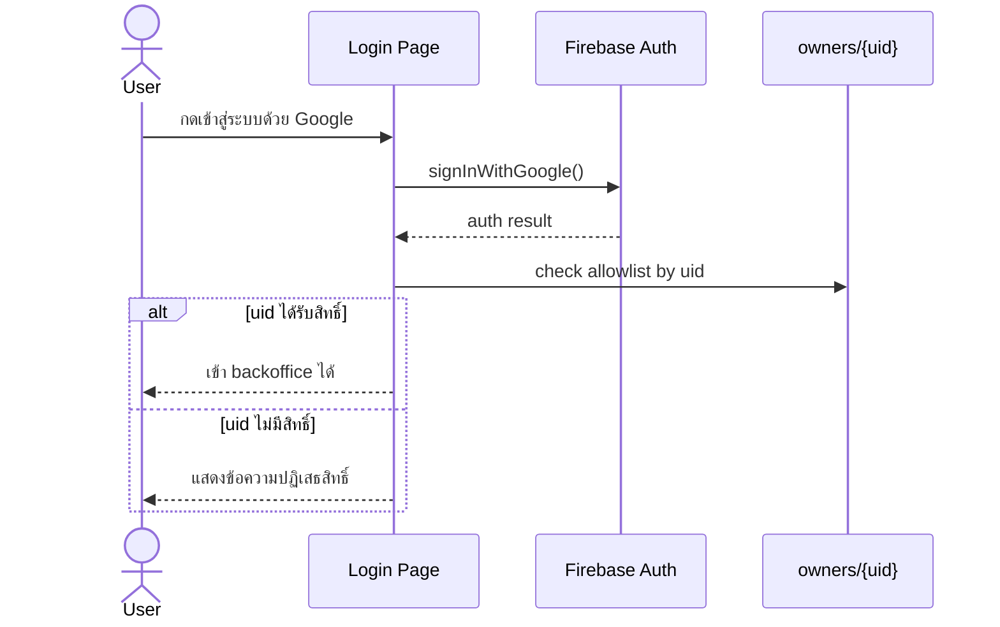

## 2. Dashboard Page

หน้าที่:

- แสดงภาพรวมสินค้า
- แสดงยอดขาย ต้นทุน กำไร
- แสดงยอดขายแยกตามแบรนด์

แหล่งข้อมูล:

- `dashboard_stats/global`
- `dashboard_brand_stats/*`

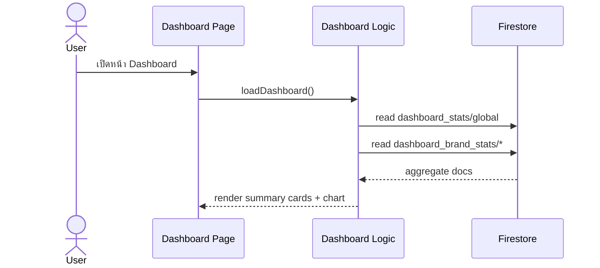

## 3. Categories Page

หน้าที่:

- เพิ่ม/แก้ไขหมวดหมู่
- เพิ่ม/แก้ไขแบรนด์
- จัดการลำดับหมวดหมู่
- จัดการลำดับแบรนด์
- จัดการ mapping `category_brands`

### 3.1 Create / Edit Category

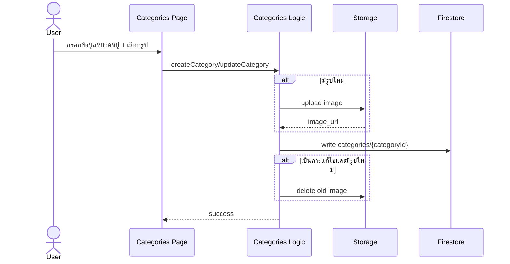

### 3.2 Create / Edit Brand

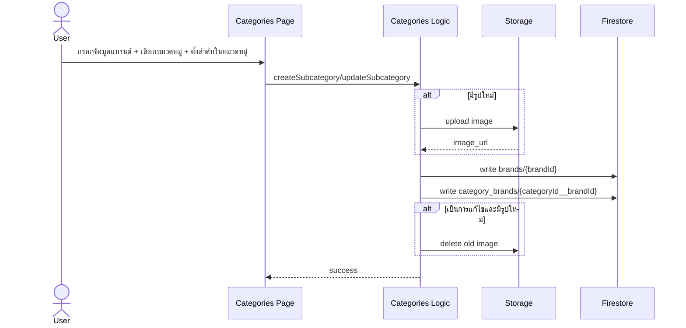

### 3.3 Toggle Active

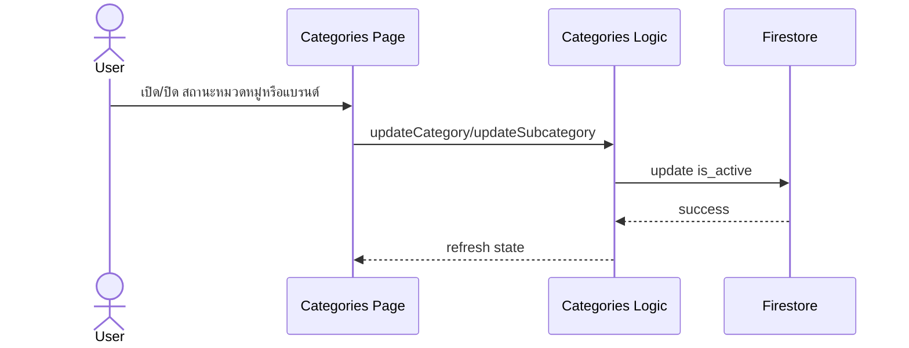

## 4. Products List Page

หน้าที่:

- ดูรายการสินค้า
- ค้นหา/กรองสินค้า
- เปิด/ซ่อนสินค้า
- เปลี่ยนสถานะ `ACTIVE <-> RESERVED`
- บันทึกขาย
- ยกเลิกขาย
- เข้าไปแก้ไขสินค้า

### 4.1 Load Products Page

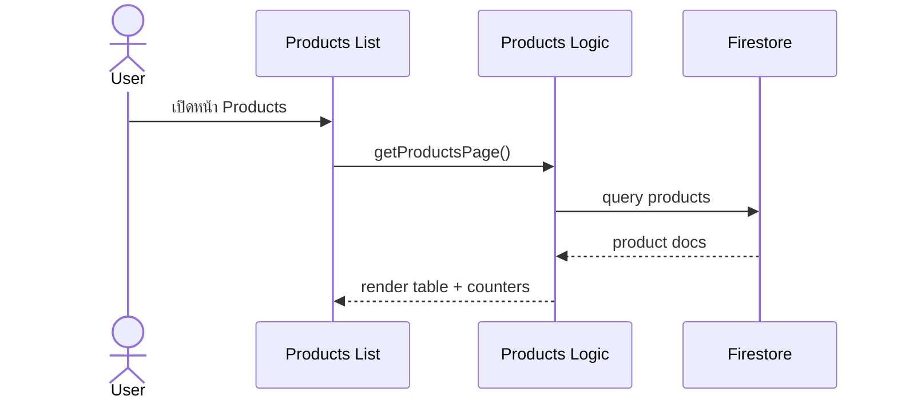

### 4.2 Toggle Show

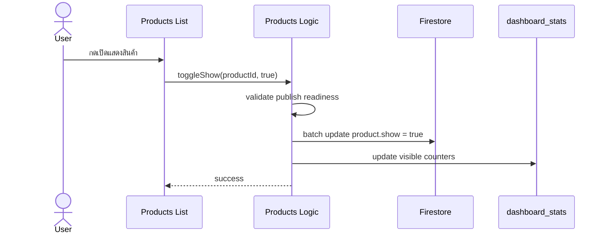

### 4.3 Set Reserved / Set Active

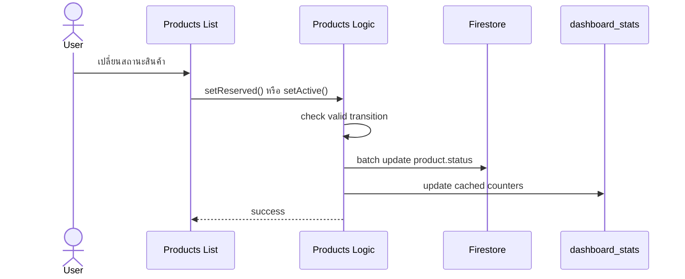

### 4.4 Confirm Sale

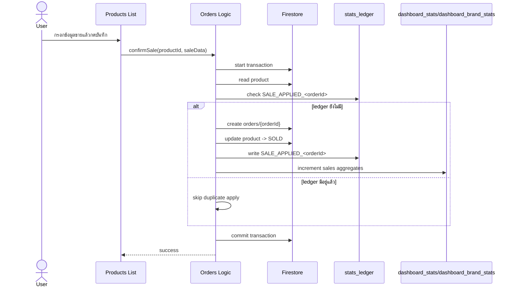

### 4.5 Undo Sale

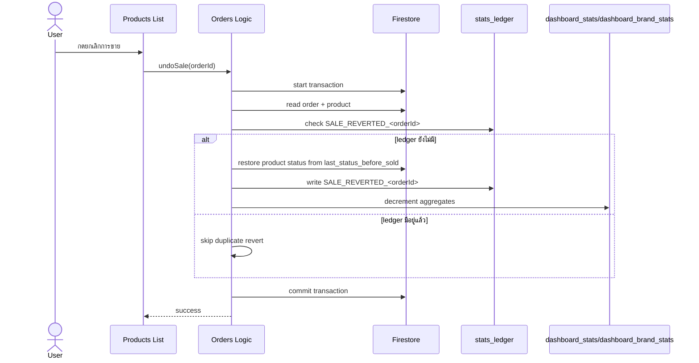

## 5. Product Create Page

หน้าที่:

- สร้างสินค้าใหม่
- ใส่ข้อมูลสินค้า
- อัปโหลดรูป
- เลือกว่าจะ publish เลยหรือเก็บเป็น draft

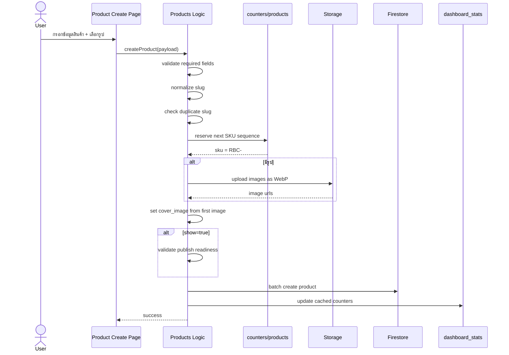

## 6. Product Edit Page

หน้าที่:

- แก้ไขข้อมูลสินค้า
- เปลี่ยนรูป / เรียงรูป
- แก้การแสดงผลหน้าเว็บ

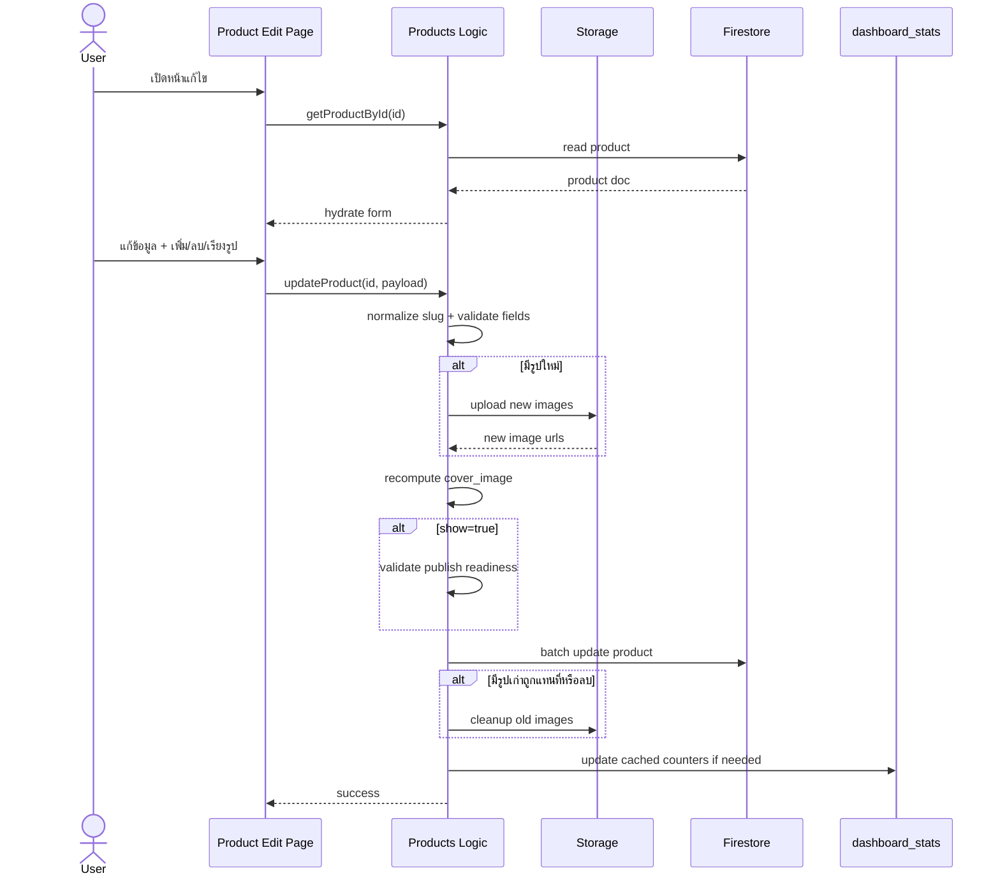

## 7. Report Page

หน้าที่:

- ดูยอดขายตามช่วงเดือน
- ดูยอดขายรวม ต้นทุน กำไร
- ส่งออก CSV

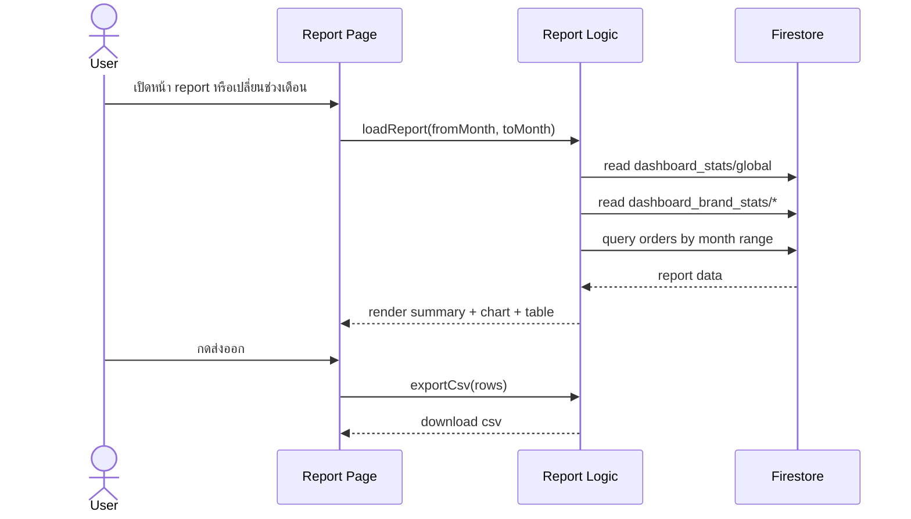

## 8. Settings Page

หน้าที่:

- ตั้งค่าแบนเนอร์หน้าแรก
- ตั้งค่าเครดิต / โลโก้
- ตั้งค่าเวลาเลื่อน banner

### 8.1 Load Settings

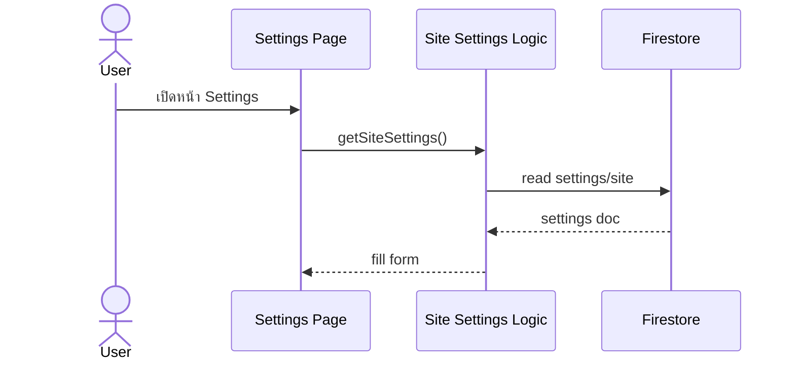

### 8.2 Save Settings

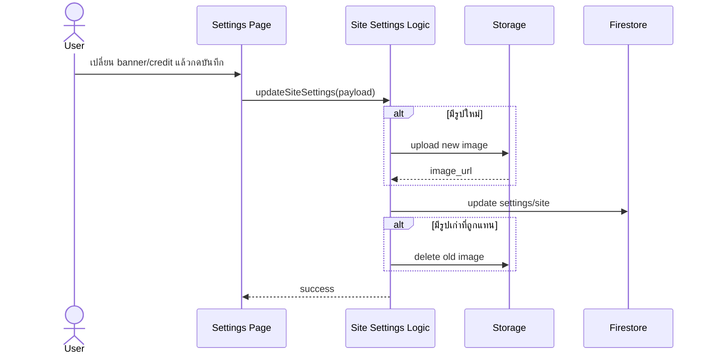

## 9. Dashboard Aggregate Rebuild Flow

ใช้ในกรณีข้อมูล cached aggregate เพี้ยนหรือหลัง cleanup/reseed

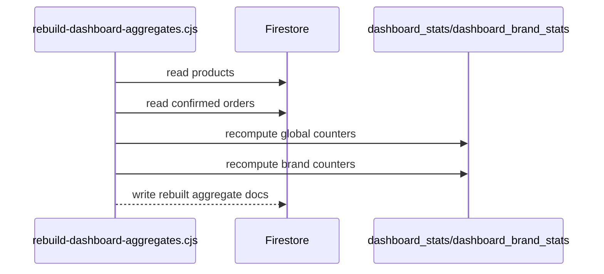

## 10. Dev Dataset Cleanup And Reseed Flow

ใช้สำหรับ reset dev data แล้วสร้าง demo data ใหม่

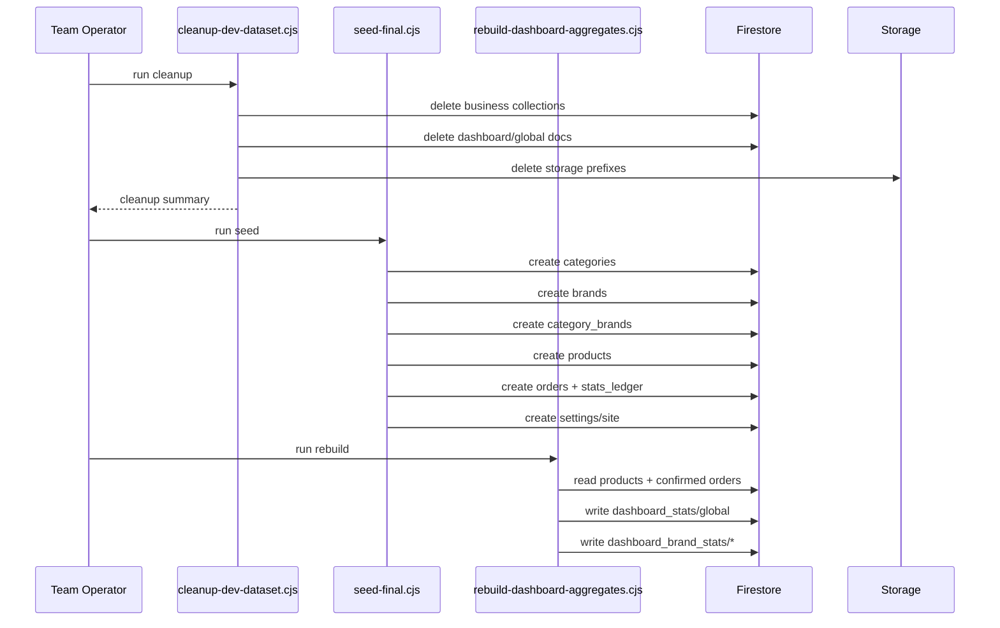

## 11. Verification Flow

ใช้ยืนยันว่าระบบพร้อมใช้งานทั้งด้านโค้ดและข้อมูล

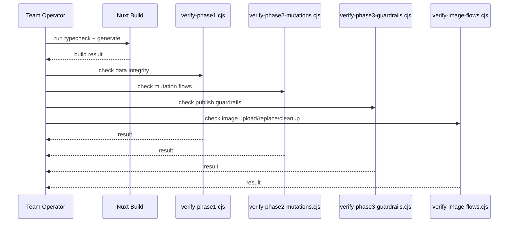

## 12. Field Mapping By Page

ส่วนนี้สรุปว่าแต่ละหน้าหลักของ backoffice อ่านหรือเขียน collection ไหน และแตะ field สำคัญอะไรบ้าง

### 12.1 Login Page

collections:

- `owners/{uid}`

fields ที่เกี่ยวข้อง:

- `uid`
- owner allowlist presence

หมายเหตุ:

- ใช้เช็กว่าบัญชี Google ที่ login เข้ามาได้รับสิทธิ์เข้า backoffice หรือไม่

### 12.2 Dashboard Page

collections:

- `dashboard_stats/global`
- `dashboard_brand_stats/{brandId}`

fields ที่เกี่ยวข้องใน `dashboard_stats/global`:

- `total_products`
- `active_products`
- `reserved_products`
- `sold_products`
- `visible_products`
- `total_sales_count`
- `total_sales_amount`
- `total_cost_amount`
- `total_profit_amount`
- `updated_at`

fields ที่เกี่ยวข้องใน `dashboard_brand_stats/{brandId}`:

- `brand_id`
- `brand_name`
- `sales_count`
- `sales_amount`
- `cost_amount`
- `profit_amount`
- `updated_at`

### 12.3 Categories Page

collections:

- `categories/{categoryId}`
- `brands/{brandId}`
- `category_brands/{categoryId__brandId}`

fields ใน `categories/{categoryId}`:

- `name`
- `slug`
- `image_url`
- `order`
- `is_active`
- `seo_title`
- `seo_description`
- `seo_image`
- `created_at`
- `updated_at`

fields ใน `brands/{brandId}`:

- `name`
- `slug`
- `image_url`
- `order`
- `is_active`
- `seo_title`
- `seo_description`
- `seo_image`
- `created_at`
- `updated_at`

fields ใน `category_brands/{categoryId__brandId}`:

- `category_id`
- `category_name`
- `category_slug`
- `brand_id`
- `brand_name`
- `brand_image_url`
- `order`
- `is_active`
- `created_at`
- `updated_at`

### 12.4 Products List Page

collections:

- `products/{productId}`
- `orders/{orderId}`
- `stats_ledger/{ledgerId}`
- `dashboard_stats/global`
- `dashboard_brand_stats/{brandId}`

fields ใน `products/{productId}` ที่หน้า list ใช้บ่อย:

- `sku`
- `name`
- `slug`
- `category_id`
- `category_name`
- `brand_id`
- `brand_name`
- `cover_image`
- `status`
- `show`
- `is_deleted`
- `is_sellable`
- `sell_price`
- `updated_at`
- `sold_at`
- `sold_price`
- `sold_channel`

fields ใน `orders/{orderId}` ที่สัมพันธ์กับ list actions:

- `status`
- `product_id`
- `brand_id`
- `brand_name`
- `sold_channel`
- `sold_price`
- `sold_yyyymm`
- `cost_price_at_sale`
- `fee`
- `profit`
- `sold_at`
- `product_snapshot`

fields ใน `stats_ledger/{ledgerId}`:

- `type`
- `ref_id`
- `entity_type`
- `entity_id`
- `operation_key`
- `product_id`
- `created_at`

### 12.5 Product Create / Edit Pages

collections:

- `products/{productId}`
- `category_brands/{categoryId__brandId}`
- `dashboard_stats/global`

fields หลักใน `products/{productId}`:

- `sku`
- `sku_seq`
- `name`
- `slug`
- `category_id`
- `category_name`
- `brand_id`
- `brand_name`
- `condition`
- `cost_price`
- `sell_price`
- `shutter`
- `defect_detail`
- `free_gift_detail`
- `cover_image`
- `images`
- `seo_title`
- `seo_description`
- `seo_image`
- `status`
- `show`
- `is_sellable`
- `is_deleted`
- `deleted_at`
- `last_status_before_sold`
- `sold_at`
- `sold_price`
- `sold_channel`
- `sold_ref`
- `created_at`
- `updated_at`

fields ใน `category_brands/{categoryId__brandId}` ที่ใช้ตอน validate:

- `category_id`
- `brand_id`
- `is_active`
- `order`

หมายเหตุ:

- หน้า create/edit ใช้ `category_brands` เพื่อตรวจว่า brand ที่เลือกยังผูกกับ category นั้นจริง
- ถ้า `show=true` ระบบจะตรวจ public-readiness ก่อน write

### 12.6 Report Page

collections:

- `orders/{orderId}`
- `dashboard_stats/global`
- `dashboard_brand_stats/{brandId}`

fields ใน `orders/{orderId}` ที่ report ใช้:

- `status`
- `product_id`
- `brand_id`
- `brand_name`
- `category_id`
- `sold_channel`
- `sold_price`
- `sold_yyyymm`
- `cost_price_at_sale`
- `fee`
- `profit`
- `sold_at`
- `product_snapshot`

fields ใน `product_snapshot` ที่ report ใช้:

- `sku`
- `name`
- `category_name`
- `brand_name`

### 12.7 Settings Page

collections:

- `settings/site`

fields ใน `settings/site`:

- `banner_auto_slide_sec`
- `banners[]`
- `credits[]`
- `updated_at`

fields ใน `banners[]`:

- `id`
- `image_url`
- `order`
- `active`

fields ใน `credits[]`:

- `id`
- `image_url`
- `order`

### 12.8 Global Loading / Toast / Shared UI

ไฟล์ที่เกี่ยวข้อง:

- `app/app.vue`
- `app/composables/useGlobalLoading.ts`
- `app/composables/useAppToast.ts`

state สำคัญ:

- `global-loading:count`
- `global-loading:message`

หมายเหตุ:

- ไม่ได้เขียนลง Firestore โดยตรง
- ใช้คุม loading overlay และ toast กลางของระบบ

### 12.9 Operational Scripts

collections ที่ script แตะบ่อย:

- `products`
- `orders`
- `stats_ledger`
- `categories`
- `brands`
- `category_brands`
- `dashboard_stats`
- `dashboard_brand_stats`
- `settings`

script ที่เกี่ยวข้อง:

- `scripts/rebuild-dashboard-aggregates.cjs`
- `scripts/repair-stats-ledger.cjs`
- `scripts/cleanup-dev-dataset.cjs`
- `scripts/reseed-dev-dataset.cjs`
- `scripts/seed-final.cjs`

## สรุป collection สำคัญ

- `categories`
- `brands`
- `category_brands`
- `products`
- `orders`
- `stats_ledger`
- `dashboard_stats`
- `dashboard_brand_stats`
- `settings`

## สรุปความสัมพันธ์สำคัญ

- Category -> Brand ใช้ `category_brands`
- Product ใช้ `category_id` + `brand_id`
- Sale ผูกกับ `orders`
- Sale/Undo ใช้ `stats_ledger` กันการนับซ้ำ
- Dashboard อ่านจาก cached aggregates ไม่ได้ derive ใหม่ทุกครั้งบนหน้า UI
